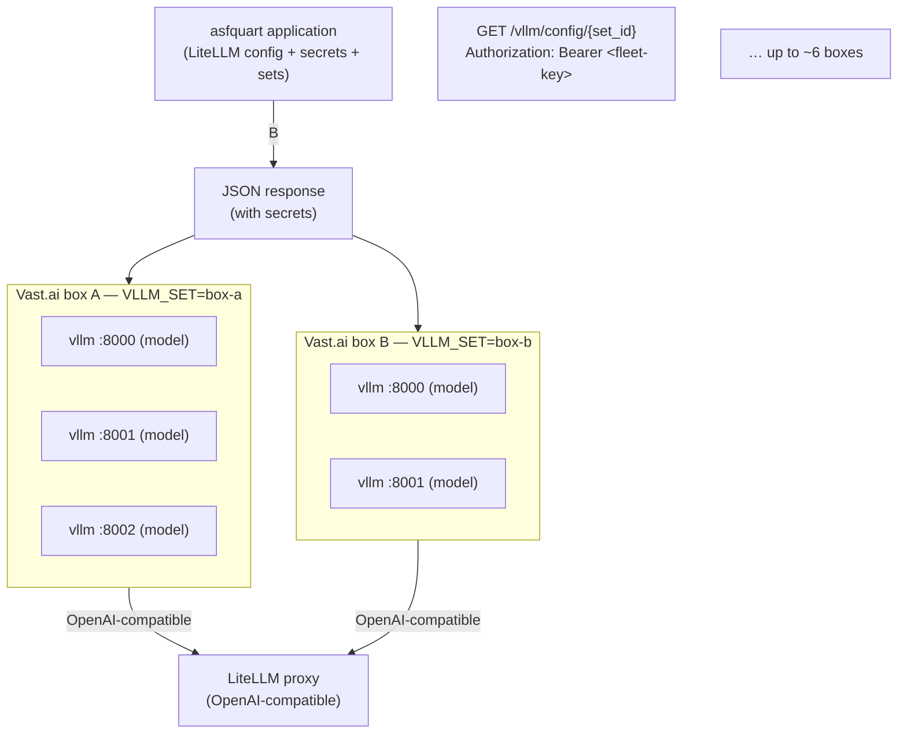

# Design: Multi-vLLM Fleet on Vast.ai with asfquart Control Plane

**Status:** Implementation in progress (JSON at launcher start; no servers.yaml)
**Date:** 2026-08-17
**Scope:** One or more Vast.ai GPU instances, each running 1–3 vLLM servers for distinct models, fronted by a LiteLLM proxy managed by an asfquart application.

---

## 1. Goals

- Run multiple distinct LLM models efficiently across a small fleet of GPU boxes (initially Vast.ai; later RunPod and others).
- Amortize fixed instance cost by placing 1–3 vLLM servers on the same machine when VRAM allows.
- Keep all model secrets and configuration in one place (the asfquart control plane).
- Use a single shared authentication secret ("fleet key") so GPU boxes can securely fetch their configuration.
- Support non-trivial per-model vLLM arguments without complicating the GPU-side template.
- Make the same mechanism reusable for other GPU providers.

**Non-goals (for now):**
- Automatic scaling / serverless.
- Per-instance secrets or short-lived tokens (can be added later).
- Reverse proxy / path-based routing on the GPU box (LiteLLM talks directly to the vLLM ports).

---

## 2. High-Level Architecture



- **asfquart** is the single source of truth for:
  - Which models exist
  - Their LiteLLM configuration
  - The real API keys used between LiteLLM and each vLLM server
  - Logical **sets** (groupings of models that should run together on one GPU box)
- Each GPU box receives only two pieces of bootstrap information: the **fleet key** and a **set identifier**.
- When the launcher process starts (not at provision time), it fetches JSON
  for its `model_set` and launches the corresponding vLLM processes.
  There is no on-disk `servers.yaml`; vLLM is long-lived so a provision-time
  file does not save anything.

---

## 3. Core Concepts

### 3.1 Fleet Key

- A single shared secret known to asfquart and to every GPU box.
- Presented as `Authorization: Bearer <fleet-key>` when fetching configuration.
- Chosen over per-instance secrets for operational simplicity (one value to manage, works across providers).
- Acceptable risk for a small, operator-controlled fleet. Can be hardened later (instance binding, short-lived tokens, etc.) without changing the rest of the design.

### 3.2 Sets (Groupings)

A **set** is a named collection of models that are intended to run on the same GPU instance.

Examples:
- `box-a` → model-a + model-b
- `box-b` → model-c + model-d + model-e
- `coding` / `heavy` / `fast` (semantic names are also fine)

asfquart owns the mapping from set → list of models (plus ports, vLLM arguments, etc.). Changing which models run where is a control-plane change only; GPU templates stay identical.

### 3.3 Set config JSON

asfquart builds JSON from `model_list.yaml` (entries whose `model_info.model_set`
matches the requested set). The launcher fetches it at process start. Same
payload as the former YAML draft; never written to disk on the box.

---

## 4. Endpoint Contract

```
GET /vllm/config/{set_id}
Authorization: Bearer <fleet-key>

Response: 200 application/json
```

- asfquart validates the fleet key (not OAuth).
- Filters `model_list.yaml` by `model_info.model_set`.
- Emits JSON (models, ports, args, API keys).
- Optional future hardening: bind the request to a known instance ID / label.

---

## 5. JSON schema

```json
{
  "set_id": "primary",
  "hf_home": "/workspace/hf-cache",
  "log_dir": "/workspace/logs",
  "servers": [
    {
      "name": "model-a",
      "model": "org/model-name",
      "port": 8000,
      "api_key": "sk-...",
      "gpu_memory_utilization": 0.42,
      "max_model_len": 16384,
      "args": ["--dtype", "auto"]
    }
  ]
}
```

Inventory fields (under each `model_list` entry’s `model_info`, so LiteLLM
`Deployment` still accepts extras):

- `model_set` — box env `VLLM_SET`
- `vllm.model` / `vllm.port` / optional util, max len, `args`
- `api_key` comes from `litellm_params` (same secret LiteLLM presents)

Notes:
- `args` may be a list of strings or a single string; the launcher normalises either form.
- `SSL_VERIFY=0` is a stopgap while **llm.apache.org is on :8443**. Drop it
  when that host serves **:443** with a public CA.

---

## 6. GPU Box Provisioning Flow

1. Instance is created from a common Vast.ai template with at least:

   ```bash
   -e FLEET_KEY=<shared-secret>
   -e VLLM_SET=box-a
   ```

   plus the usual image, ports (8000–8002), disk size, SSH, etc.

2. Provisioning (`hosting/vast/provision.sh`):
   - Installs `launcher.py` and a supervisor unit.
   - Does **not** fetch model config.

3. Launcher (when supervisor starts it):
   - Reads `FLEET_KEY`, `VLLM_SET`, `ASFQUART_URL`.
   - GETs JSON from asfquart.
   - For each server entry builds and runs:

     ```bash
     vllm serve <model> --host 0.0.0.0 --port <port> \
       --api-key <api_key> \
       --gpu-memory-utilization … \
       --max-model-len … \
       <extra args…>
     ```

   - Redirects logs to `/workspace/logs/<name>.log`.
   - Monitors processes; optional restart-on-exit.
   - Handles SIGTERM/SIGINT cleanly.

4. LiteLLM (managed by asfquart) is configured with matching `api_base` values and the same API keys, so it can reach each vLLM server.

---

## 7. Vast.ai Template Requirements (summary)

- Image: `vastai/vllm:…` or `vllm/vllm-openai:…` (or a thin derivative).
- Launch mode: SSH (or Jupyter + SSH).
- Ports: 8000, 8001, 8002 mapped.
- Disk: large enough for the heaviest set of models that will be assigned.
- Environment:
  - `FLEET_KEY`
  - `VLLM_SET`
  - (optional) `ASFQUART_URL` if not hard-coded / discoverable
- On-create: `provision.sh` (launcher + supervisor; JSON fetch is later).

The template itself is identical for every box; only the two env vars change.

---

## 8. Security Considerations

- Fleet key is the only long-lived secret that must be present on GPU boxes.
- Real model API keys exist only inside asfquart and in the short-lived YAML that is fetched at boot.
- Endpoint must be served over HTTPS.
- Recommended: restrict endpoint reachability (private network, Tailscale, Cloudflare Access, IP allow-list, etc.).
- Future hardening options (not required for v1):
  - Instance-ID binding
  - Short-lived bootstrap tokens
  - Signed JWTs instead of a static fleet key

---

## 9. Future Extensions

- Same endpoint + fleet key used by RunPod (or any other provider) instances.
- Additional set metadata (preferred GPU type, minimum VRAM, etc.) for scheduling.
- Health / readiness reporting back to asfquart.
- Automatic re-fetch of configuration on SIGHUP or periodic interval.

---

## 10. Open Points / Decisions Still Soft

- Exact URL path and HTTP method for the config endpoint.
- (Resolved) No on-disk set config; launcher fetches JSON at start.
- Restart policy details (always restart, restart with backoff, give up after N failures, …).
- Naming of sets (`box-a` vs semantic names vs both).
- How `ASFQUART_URL` is supplied (env var, hard-coded, DNS, …).

---

## 11. Implementation Order (suggested)

Box-side files: `hosting/` (runbooks next to scripts). Control plane stays
in the Quart app. v1: stock Vast vLLM template + pinned on-start, not a
derived image — see `hosting/vast/README.md`.


1. Finalise JSON schema and endpoint contract.
2. Implement asfquart endpoint (auth + JSON from `model_list.yaml`).
3. Implement Python launcher fetch + spawn.
4. Create / adjust Vast.ai template.
5. Wire LiteLLM model entries to the running vLLM ports.
6. Smoke-test with one set on one box, then expand.

---

*End of design document.*
