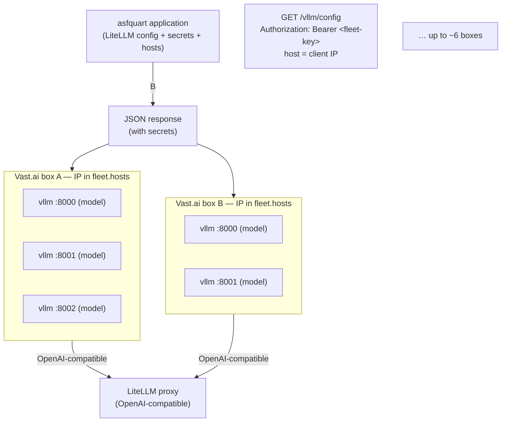

# Design: Multi-vLLM Fleet on Vast.ai with asfquart Control Plane

**Status:** Implementation in progress (JSON → Supervisor units at box-start)
**Date:** 2026-08-17
**Scope:** One or more Vast.ai GPU instances, each running 1–3 vLLM servers for distinct models, fronted by a LiteLLM proxy managed by an asfquart application.

---

## 1. Goals

- Run multiple distinct LLM models efficiently across a small fleet of GPU boxes (initially Vast.ai; later RunPod and others).
- Amortize fixed instance cost by placing 1–3 vLLM servers on the same machine when VRAM allows.
- Keep all model secrets and configuration in one place (the asfquart control plane).
- Use a single shared authentication secret ("fleet key") so GPU boxes can securely fetch their configuration.
- Support non-trivial per-model vLLM arguments without complicating the GPU-side template.
- Make the same mechanism reusable for other GPU providers.

**Non-goals (for now):**
- Automatic scaling / serverless.
- Per-instance secrets or short-lived tokens (can be added later).
- Reverse proxy / path-based routing on the GPU box (LiteLLM talks directly to the vLLM ports).

---

## 2. High-Level Architecture



- **asfquart** is the single source of truth for:
  - Which models exist
  - Their LiteLLM configuration
  - The real API keys used between LiteLLM and each vLLM server
  - Logical **hosts** (models + ports on one GPU box, keyed by public IP)
- Each GPU box receives the **fleet key** on the template. asfquart maps
  `request.remote_addr` (ProxyFix / X-Forwarded-For behind Hypercorn or Apache)
  to `fleet.hosts`.
- At box-start, the provider installer fetches JSON for that IP
  and installs native process units (Vast: Supervisor). There is no on-disk
  `servers.yaml` and no Python process manager.

---

## 3. Core Concepts

**Catalog** — `model_list.yaml`: how to serve each recipe. **Model** — one
catalog recipe (`model_name`, e.g. `gemma4-26b`). **Server** — one vLLM
process on a host (`port`). Box JSON `servers[].model` is the **HF
weights id** (`model_info.vllm.model`); that field name is deferred.

### 3.1 Fleet Key

- A single shared secret known to asfquart and to every GPU box.
- Presented as `Authorization: Bearer <fleet-key>` when fetching configuration.
- Chosen over per-instance secrets for operational simplicity (one value to manage, works across providers).
- Acceptable risk for a small, operator-controlled fleet. Can be hardened later (instance binding, short-lived tokens, etc.) without changing the rest of the design.

### 3.2 Hosts

A **host** is a GPU box public IP. Its value is a list of `[model, port]` or
`[model, port, name]` rows. Optional **name** lets two processes share a
catalog model (e.g. two qwen3 on one box).

asfquart owns placement in `config.yaml` → `fleet.hosts`. The catalog is how
to serve, not where. Changing placement is a control-plane change only; GPU
templates stay identical (shared `FLEET_KEY`).

### 3.3 Host config JSON

asfquart builds JSON from `fleet.hosts.<client-ip>` joined to the catalog. Vast
`install_set.py` fetches `GET /vllm/config` at box-start and writes Supervisor
programs. Same payload; never a `servers.yaml`.

---

## 4. Endpoint Contract

```
GET /vllm/config
Authorization: Bearer <fleet-key>

Response: 200 application/json
```

- asfquart validates the fleet key (not OAuth).
- Looks up `fleet.hosts` by client IP (`request.remote_addr` after ProxyFix).
- Emits JSON (host, servers: name, HF weights id, host, port, args, API keys).

---

## 5. JSON schema

```json
{
  "host": "127.0.0.1",
  "servers": [
    {
      "name": "model-a",
      "model": "org/model-name",
      "host": "127.0.0.1",
      "port": 8000,
      "api_key": "sk-...",
      "gpu_memory_utilization": 0.42,
      "max_model_len": 16384,
      "args": ["--dtype", "auto"]
    }
  ]
}
```

Catalog model (`model_info.vllm`): HF weights id, optional util, max len, `args`.
Host row (`fleet.hosts`): `[model_name, port]` or `[model_name, port, name]`.
`api_key` comes from `litellm_params` (same secret LiteLLM presents).

Notes:
- `args` may be a list of strings or a single string; the installer normalises either form.
- `SSL_VERIFY=0` is a stopgap while **llm.apache.org is on :8443**. Drop it
  when that host serves **:443** with a public CA.

---

## 6. GPU Box Provisioning Flow

1. Instance is created from a common Vast.ai template with at least:

   ```bash
   -e FLEET_KEY=<shared-secret>
   ```

   plus the usual image, ports (8000–8002), disk size, SSH, etc.

2. Provisioning (`hosting/vast/provision.sh` → `install_set.py`):
   - GETs JSON from asfquart.
   - Writes one Supervisor `[program:vllm-<name>]` per server.
   - `supervisorctl update`. supervisord runs:

     ```bash
     vllm serve <model> --host 0.0.0.0 --port <port> \
       --api-key <api_key> \
       --gpu-memory-utilization … \
       --max-model-len … \
       <extra args…>
     ```

   Logs go to `$DATA_DIRECTORY/logs/<name>.log` on Vast. Restart is Supervisor
   `autorestart` / `startretries`.

3. LiteLLM (managed by asfquart) is configured with matching `api_base` values and the same API keys, so it can reach each vLLM server.

---

## 7. Vast.ai Template Requirements (summary)

- Image: `vastai/vllm:…` or `vllm/vllm-openai:…` (or a thin derivative).
- Launch mode: SSH (or Jupyter + SSH).
- Ports: 8000, 8001, 8002 mapped.
- Disk: large enough for the heaviest set of models that will be assigned.
- Environment:
  - `FLEET_KEY` (template)
  - `ASFQUART_URL`
- On-create: `provision.sh` → `install_set.py` (JSON → Supervisor units).

The template is identical for every box. Placement is `fleet.hosts` by public IP.

---

## 8. Security Considerations

- Fleet key is the only long-lived secret that must be present on GPU boxes.
- Real model API keys exist only inside asfquart and in the short-lived YAML that is fetched at boot.
- Endpoint must be served over HTTPS.
- Recommended: restrict endpoint reachability (private network, Tailscale, Cloudflare Access, IP allow-list, etc.).
- vLLM `GET /health` has **no API key**. `fleet.hosts` host:port must be on a
  private path (Tailscale / WireGuard / allow-list). Tunnels are out of scope for v1.
- Future hardening options (not required for v1):
  - Instance-ID binding
  - Short-lived bootstrap tokens
  - Signed JWTs instead of a static fleet key

---

## 9. Future Extensions

- Same endpoint + fleet key used by RunPod (or any other provider) instances.
- Additional set metadata (preferred GPU type, minimum VRAM, etc.) for scheduling.
- Automatic re-fetch of configuration on SIGHUP or periodic interval.
- Health-gated LiteLLM `api_base` add/remove (YAML remains SoT; no
  `STORE_MODEL_IN_DB`). Spike a reload path before coding.
- Do **not** use LiteLLM `GET /health` as the vLLM boot probe (it runs real
  completions). asfquart already probes vLLM `/health` and, rarely, LiteLLM
  `/health` only to detect **skew**.

---

## 10. Open Points / Decisions Still Soft

- Exact URL path and HTTP method for the config endpoint.
- (Resolved) No on-disk set config; Vast writes Supervisor units from JSON at box-start.
- Restart policy details (always restart, restart with backoff, give up after N failures, …).
- Naming of sets (`box-a` vs semantic names vs both).
- How `ASFQUART_URL` is supplied (env var, hard-coded, DNS, …).

---

## 11. Implementation Order (suggested)

Box-side: `hosting/vast/` (Supervisor installer). Control plane stays
in the Quart app. v1: stock Vast vLLM template + `provision.sh`.


1. Finalise JSON schema and endpoint contract.
2. Implement asfquart endpoint (auth + JSON from `model_list.yaml`).
3. Vast `install_set.py` (JSON → Supervisor); no launcher.
4. Create / adjust Vast.ai template.
5. Wire LiteLLM models to the running vLLM ports.
6. Smoke-test with one set on one box, then expand.

---

*End of design document.*
